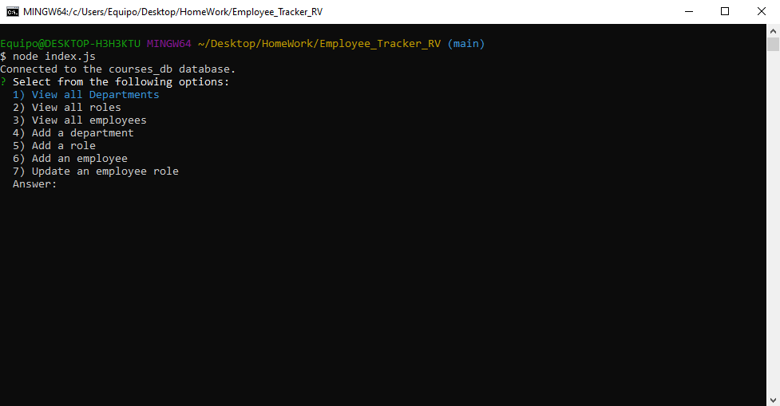
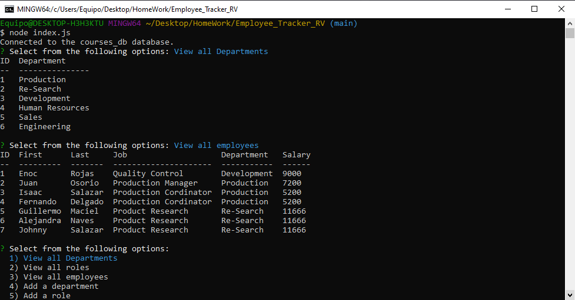

# Employee Tracker

## Description

- What was your motivation?  
  This was a task to better understand how we can use databases and update, remove and add information having the right parameters

- Why did you build this project?  
  To simulate how working with multiple tables can be, to relate them and make work easier.

- What problem does it solve?  
  Its a very basic company management system, where one can add and view information stored about the company

- What did you learn?  
  How databases can be linked, and how to input information using inquirer.
   
- Briefly describe your Project:  
  Basic Company Database management system, where a person can add, remove, or update information. The project has some seeded data previously to make it easier, but this project can be started empty.
   

## Table of Contents

- [Description](#description)
- [Installation](#installation)
- [Usage](#usage)
- [Contributors](#contributors)
- [Tests](#tests)
- [Questions](#questions)

## Installation

What are the steps required to install your project?

    Uses Node and you will need to invoke it using "node index.js" where the main file index is located.

## Usage

Provide instructions for use:

    Clone this project, npm i for dependencies and run the command above mentioned.

## Contributors

Enoc Rojas Villegas

## Tests

No testing included

## Questions

Video Explaining Functionality: https://github.com/Enrique-Rojas-Villegas/Employee_Tracker_RV.git

Check out my work as well!
Find me on GitHub: 
 (https://github.com/Enrique-Rojas-Villegas)  
Email me: 📧 rojiyoyo@gmail.com
